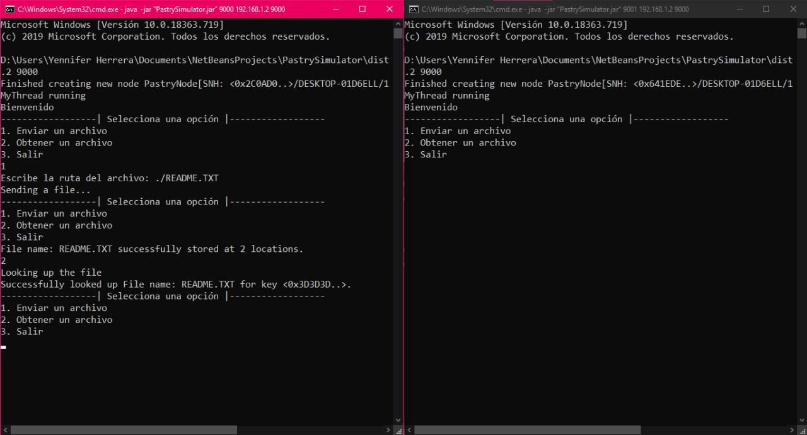

# Pastry Simulator

A Pastry implementation in Java using [FreePastry](https://www.freepastry.org). Store files on a Peer to Peer network.

## How to run

1. You must include the FreePastry lib. [Download](https://www.freepastry.org/FreePastry/)

2. Generate .jar

3. Open the CLI and go to /dist location

```shell
  cd /dist
```

4. Run the following command

```shell
  java -jar "PastrySimulator.jar" 9000 [your local IP] 9000
```

5. (Optional) Open another CLI and run the following command, you can repeat this step as many times as you want (`for i=1; i<n; i++`)

```shell
  java -jar "PastrySimulator.jar" 9000+i [your local IP] 9000
```

6. You must include 2 more libraries:

   - xmlpull_1_1_3_4a.jar - [Download](https://github.com/ChronosX88/FreePastry/blob/master/lib/xmlpull_1_1_3_4a.jar)
   - xpp3-1.1.3.4d_b2.jar - [Download](https://github.com/ChronosX88/FreePastry/blob/master/lib/xpp3-1.1.3.4d_b2.jar)

7. Now, you can store files on a P2P network


